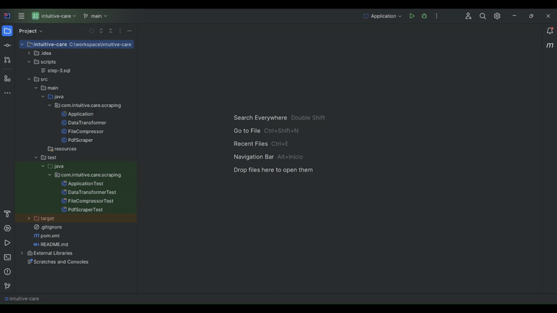

# **Testes de Nivelamento**

---

## **Teste de Web Scraping**

**Objetivo:**  
Automatizar o processo de download de arquivos PDF (Anexos I e II) a partir de um site público e compactá-los em um único arquivo.



## **Tecnologias Utilizadas**

- **Java:** Utilizado para Web Scraping e Transformação de Dados.

### **Passos realizados:**
- **Acesso ao site:** Foi feito o acesso ao site [https://www.gov.br/ans/pt-br/acesso-a-informacao/participacao-da-sociedade/atualizacao-do-rol-de-procedimentos](https://www.gov.br/ans/pt-br/acesso-a-informacao/participacao-da-sociedade/atualizacao-do-rol-de-procedimentos) para localizar os anexos.
- **Download de PDFs:** Os Anexos I e II foram baixados em formato PDF.
- **Compactação:** Todos os PDFs foram compactados em um único arquivo ZIP.

---

## **Teste de Transformação de Dados**


**Objetivo:**  
Extrair dados do PDF e transformá-los em um formato estruturado CSV.

## **Tecnologias Utilizadas**

- **Java:** Utilizado para Web Scraping e Transformação de Dados.

### **Passos realizados:**
- **Extração de Dados:** Utilizei Java para extrair os dados da tabela "Rol de Procedimentos e Eventos em Saúde" do Anexo I.
- **Transformação para CSV:** Os dados extraídos foram salvos em um arquivo CSV.
- **Compactação:** O arquivo CSV foi compactado em um arquivo ZIP com o nome `Teste_Mayara.zip`.
- **Substituição de Abreviações:** Realizei a substituição das abreviações `OD` e `AMB` pelas descrições completas conforme a legenda no rodapé.


**Localização do código:**
- A parte de Transformação de Dados foi implementada na classe `DataTransformer`.
- A parte de Extração dos dados do PDF foi implementada na classe `PdfScraper`.
- Para realizar o fluxo de extração e transformação RUN `Application`.

---

## **Teste de Banco de Dados**


**Objetivo:**  
Criar e executar scripts SQL para importar dados de operadoras de planos de saúde e realizar consultas analíticas.

## **Tecnologias Utilizadas**

- **MySQL:** Utilizado para manipulação e consulta de dados no Banco de Dados.
- **SQL:** Utilizado para manipulação e consulta de dados no Banco de Dados.


### **Passos realizados:**
- **Download de Dados:** Baixei os arquivos de dados do repositório público da ANS (Agência Nacional de Saúde Suplementar).
- **Estruturação do Banco:** Criei queries SQL para estruturar as tabelas necessárias para armazenar os dados no MySQL.
- **Importação dos Dados:** Desenvolvi queries para importar os dados dos arquivos CSV para o banco de dados.
- **Consulta Analítica:** Elaborei as seguintes queries para responder às perguntas analíticas:
    - Quais as 10 operadoras com maiores despesas em "EVENTOS/ SINISTROS CONHECIDOS OU AVISADOS DE ASSISTÊNCIA A SAÚDE MEDICO HOSPITALAR" no último trimestre?
    - Quais as 10 operadoras com maiores despesas nessa categoria no último ano?

    
---

## **Estrutura do Projeto**


A estrutura do projeto está organizada da seguinte forma:

---

## **Como Executar**

### **Pré-requisitos:**
- Java 17 ou superior
- MySQL 8 ou superior


### **Passos para executar:**


#### **1. Web Scraping e Transformação de Dados**
1. Clone o repositório:
    ```bash
    git clone https://github.com/mayarabrainer/intuitive-care.git
    ```
2. Navegue até o diretório do projeto:
    ```bash
    cd intuitive-care
    ```
3. Execute o código Java para realizar o web scraping e transformação de dados:
    ```bash
    java -jar intuitive-care.jar
    ```


#### **2. Banco de Dados**
1. Execute os scripts SQL para configurar as tabelas no banco de dados MySQL. Os scripts estão na pasta `/scripts/step-3.sql`.
2. Importe os arquivos CSV utilizando as queries de importação.
3. Execute as consultas analíticas para obter as 10 operadoras com maiores despesas.

